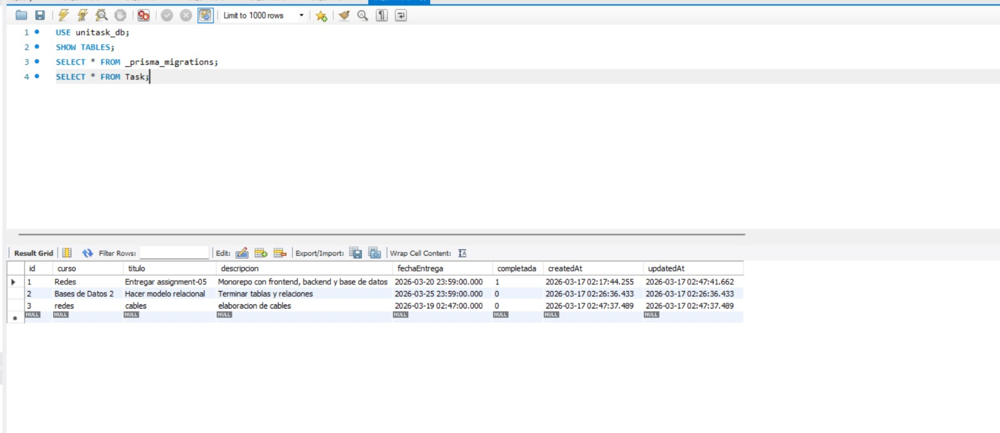

# UniTask - Assignment 05

## Descripción del proyecto

**UniTask** es una aplicación web sencilla desarrollada bajo una arquitectura **monorepo**, orientada a la gestión de tareas académicas.  
El sistema permite registrar, visualizar, actualizar y eliminar tareas mediante una interfaz web conectada a una API y a una base de datos.

El objetivo principal de este proyecto fue demostrar la integración entre:

- **Frontend**
- **Backend**
- **Base de datos**
- **Migraciones**
- **Despliegue en la nube**
- **Documentación de API**

---

## Arquitectura del proyecto

El proyecto fue organizado como un **monorepo**, separando el frontend y el backend en carpetas independientes dentro de una misma base de código.

### Estructura general

```bash
assignment-05/
│
├── apps/
│   ├── frontend/
│   └── backend/
│
├── package.json
└── README.md
````

---

## Tecnologías utilizadas

### Frontend

* React
* Vite
* CSS

### Backend

* Node.js
* Express

### Base de datos

* MySQL

### ORM y migraciones

* Prisma

### Documentación de API

* Swagger

### Despliegue

* Frontend: Render
* Backend: Render
* Base de datos: Aiven MySQL

---

## Funcionalidades implementadas

El sistema incluye las siguientes funcionalidades:

* Visualización de tareas registradas
* Creación de nuevas tareas
* Actualización del estado de una tarea
* Eliminación de tareas
* Consulta del estado del backend
* Documentación interactiva de la API mediante Swagger

---

## Rutas principales del backend

### Estado del servicio

* `GET /`
* `GET /health`

### Tareas

* `GET /tasks`
* `GET /tasks/:id`
* `POST /tasks`
* `PATCH /tasks/:id`
* `DELETE /tasks/:id`

### Documentación

* `GET /docs`

---

## URLs del proyecto

### Frontend

`https://unitask-frontend.onrender.com`

 ### Backend

`https://assignment-05-yg1l.onrender.com`

### Documentación de la API

`https://assignment-05-yg1l.onrender.com/docs`

---


## Migraciones

Se realizaron migraciones mediante Prisma para la creación de la tabla principal del sistema.

### Modelo principal

**Task**

* id
* curso
* titulo
* descripcion
* fechaEntrega
* completada
* createdAt
* updatedAt

Las migraciones se encuentran dentro de:

```bash
apps/backend/prisma/migrations/
```

---

## Evidencia de base de datos


---

## Estado del despliegue

Durante el desarrollo local, el sistema logró funcionar correctamente en sus operaciones principales de lectura, creación, actualización y eliminación de tareas.

En el despliegue final en la nube, el **frontend** y el **backend** lograron publicarse correctamente y fue posible verificar el funcionamiento general de la interfaz y de varias rutas de la API. Sin embargo, durante la integración con la base de datos en producción se presentó una **incidencia de conectividad entre el backend desplegado y el servicio de base de datos externo**, lo que afectó la estabilidad de algunas operaciones de escritura en el entorno final.

Por esta razón, el proyecto se entrega con:

* estructura monorepo funcional
* frontend desplegado
* backend desplegado
* documentación de API disponible
* migraciones implementadas
* conexión local validada durante el desarrollo
* integración en la nube parcialmente limitada por la conectividad del entorno de despliegue hacia la base de datos externa

---

## Observaciones técnicas

* El sistema fue desarrollado siguiendo una separación clara entre frontend y backend.
* Se implementó documentación de API para facilitar pruebas y validación.
* Se utilizó Prisma para modelado y migraciones.
* El despliegue fue realizado con servicios gratuitos en la nube.
* La incidencia final se concentró específicamente en la conectividad de base de datos en producción, no en la estructura general del proyecto.

---

## Repositorio

Rama de trabajo solicitada:

```bash
assignment-05
```

Repositorio de GitHub:

`https://github.com/AlexDLG1/assignment-05`

---

## Conclusión

El proyecto permitió desarrollar una aplicación web completa bajo una arquitectura monorepo, integrando frontend, backend, base de datos, migraciones y documentación de API.
No se pudo establecer la conexión con la base de datos. El servicio de hosting (Render) ha rechazado la solicitud debido a que se han alcanzado los límites de uso del plan gratuito. Las limitaciones de ancho de banda y tiempo de actividad inactivo en la capa gratuita impiden que la base de datos permanezca accesible de forma continua. Para una conexión estable, es necesario actualizar a un plan de pago.
